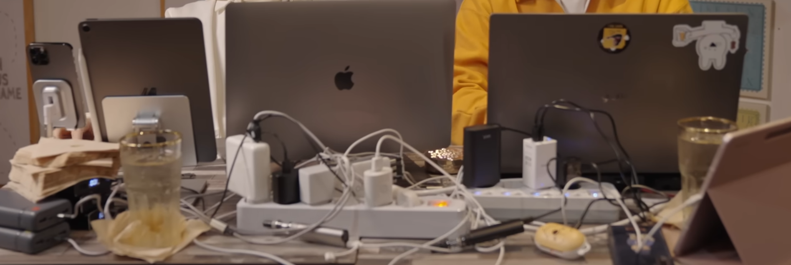
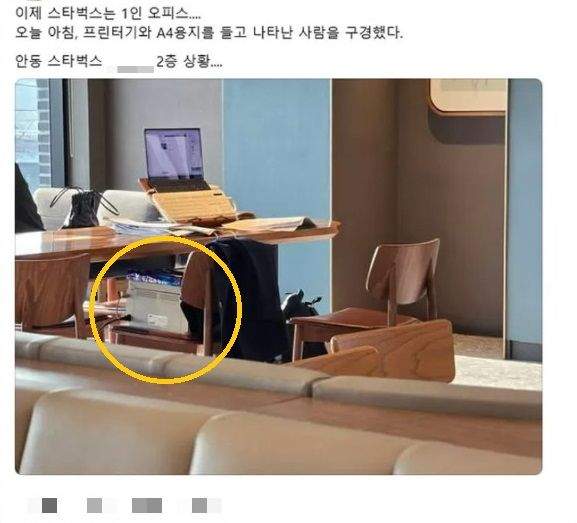
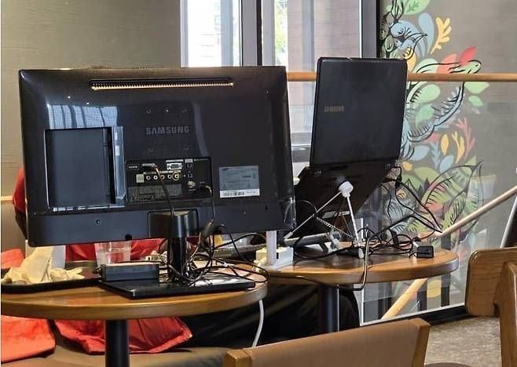
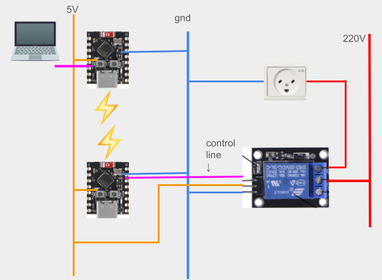
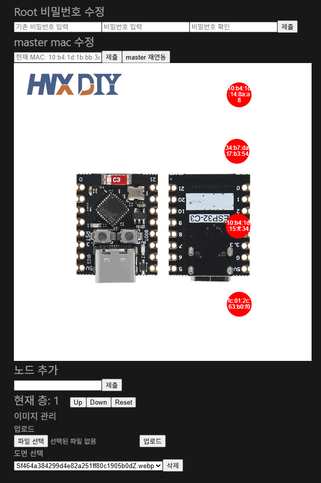
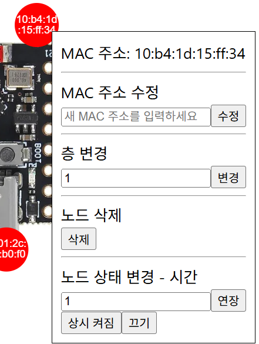
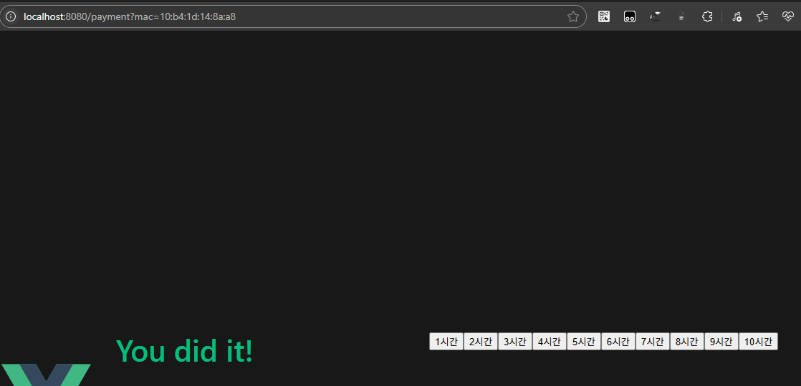
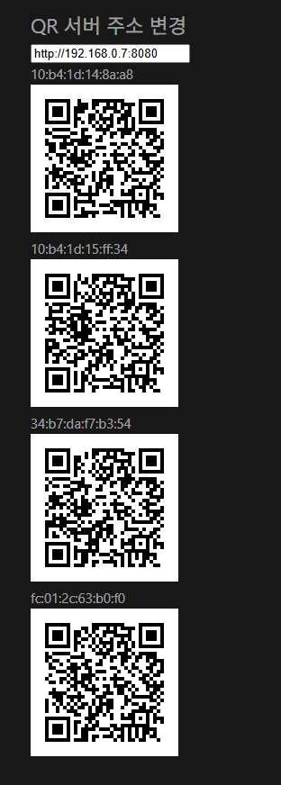
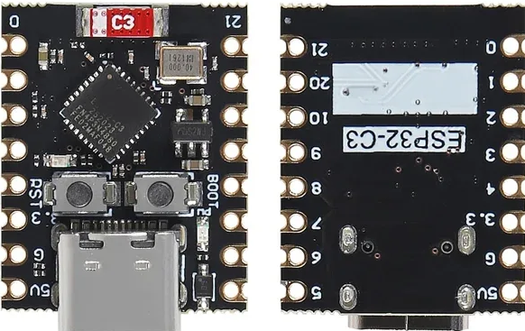
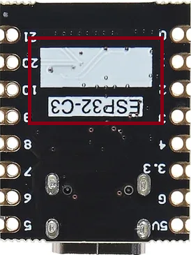

# 도입 배경

아래의 사진들에서 알 수 있다시피 전기 도둑이 사회적으로 심각한 것을 알 수 있습니다. 이 전기 도둑을 줄일 수 있는 방법이 없을까요?


<p style="text-align: center; font-size: 0.9em; color: #555; margin-top: 5px;">출처: 너덜트/카페 전기 도둑</p>


<p style="text-align: center; font-size: 0.9em; color: #555; margin-top: 5px;">출처: 갈무리</p>


<p style="text-align: center; font-size: 0.9em; color: #555; margin-top: 5px;">출처: 갈무리</p>

단순히 카페에서 음료수를 마시고 대화하는데는 30분 ~ 1시간, 만약 공부를 한다면 평균 1시간 30분 정도로 나타납니다. 따라서 간단한 충전용 콘센트 허용은 1시간, 초과하여 사용하고자 할때는 과금을 하는 방향으로 비즈니스 모델을 설계하였습니다.

ESP32와 PortOne의 결제 시스템을 활용하여 전기 도둑을 원천적으로 방지하는 시스템을 제작하였습니다.

# 동작

[](https://youtu.be/M93eWmQG_tY)

# 개발 기간

2025.07.21 ~ 2025.07.31 (2주)

# 프로젝트 기술 스택

## 프론트엔드

- Vue.JS
- Typescript
- bun as Runtime
- PortOne API V2
- qrcode from `@vueuse/integrations`
- konva as `canvas`

## 백엔드

- Kotlin 1.9.25 / Java 17
- Spring Boot 3.5.3
- H2 database
- JSerialComm for communication with esp32

## 엣지 디바이스

- ESP32
- CPP
- relay switch

# 프로젝트 구성도

## 전체 회로도



## 데이터베이스 구조

### 결제 정보

| column     | type    | default       | 설명                             |
| ---------- | ------- | ------------- | -------------------------------- |
| id         | Long    | null          | 결제 history id입니다.           |
| createdAt  | Instant | Instant.now() | 결제 생성 시각입니다.            |
| succeedAt  | Instant | null          | 결제 완료 시각입니다.            |
| paymentId  | String  | ""            | PortOne에 넘겨준 결제 ID 입니다. |
| price      | Long    | 0             | 결제 금액입니다.                 |
| macAddress | String  | ""            | 결제한 자리의 MAC 주소 입니다.   |

## ESP32 위치 정보

> 읽기/쓰기가 빈번하진 않아 파일로 관리합니다.

```json
{
  "masterMac" : master node의 mac 주소,
  "slaveMacs" : [ {
    "macAddress" : slave node의 mac 주소,
    "position" : {
      "x" : canvas에서의 x 좌표,
      "y" : canvas에서의 y 좌표,
      "floor" : 1
    },
    ...
  } ]
}
```

## 서버 디렉터리 구조

```
├─frontend
│	└─ {{ spa build 파일 }}
├─password
│	└─ HASH_ENCODED_PASSWORD # 이 값의 원본 값을 비밀번호로 합니다.
└─uploads
	└─ canvas의 배경 이미지들
```

## 페이지 구조

관리 페이지, 결제 페이지, qr 생성 페이지로 구성됩니다.

### 관리 페이지

> 이 페이지는 root 로그인을 필요로 합니다.



페이지 전반에 걸친 비밀번호 변경 및 master mac 수정, slave node 추가, 층 관리, 도면 추가 등을 할 수 있습니다.



빨간 버튼을 누르면 노드 정보를 수정할 수 있습니다.

### 결제 페이지

> 결제 페이지로 들어오는 것은 QR로 가능합니다. mac 주소만 알고있다면, mac 주소를 쿼리 파라미터로 전달하여 접근 가능하기도 합니다.



버튼을 눌러 결제 모듈을 띄웁니다. 모바일의 경우 새 창을 띄워 결제합니다.

### QR 생성 페이지

> 이 페이지는 root 로그인을 필요로 합니다.

> QR 관리용 페이지 입니다. Node가 추가되었거나 수정될 경우, 이 페이지에서 맞는 mac 이미지를 출력하여 사용합니다.



# 트러블 슈팅

## ESP32의 ESP-NOW가 되지 않는 현상

ESPXX 시리즈는 ESP-NOW를 통해 N:M 통신이 가능합니다. 이를 활용하기 위해 ESP 시리즈 중 매우 작은 `ESP32-C3` 모듈을 구매하였습니다.



이 모듈은 매우 작아 안테나가 어디에 존재하는지 확실치 않았습니다. 전면의 위쪽에 보이는 SMD가 안테나라고 생각하여 브레드보드에 꽂고 테스트하고 있었습니다.

브레드보드에 꽂을때는 esp-now가 동작하지 않고 브레드보드에서 분리하였을때는 esp-now가 동작하였습니다. 브레드보드에는 금속 스트립을 내장하고 있고, 이를 매우 가까이 놓은 것이 문제였습니다. 이때문에 금속 스트립이 신호를 반사, 흡수, 간섭시켜 송수신 감도(SNR)이 감소하였습니다.


저 부분에 안테나가 프린팅 되어 있기 때문에 브레드보드에 꽉 끼운 상태로는 신호가 약해지는 것이 원인이었습니다.

L자 GPIO 연장 커넥터를 주문하였고, 이를 통해 이 문제를 해결하였습니다.

## Konva의 웹과 모바일 웹에서의 동작 차이

> 현재 최신 브라우저들은 `PointerEvent`를 사용합니다. `MouseEvent`와 `TouchEvent`를 통합하였습니다.

> 통합 했더라도 완벽한 통합이 아닌 인터페이스의 통합이라 다룰때는 결국 저수준으로 다뤄야 합니다.

konva에서 click 이벤트를 적용할 때 아래와 같이 사용하였습니다.

```ts
<v-stage
    :config="{ width: imageWidth, height: imageHeight }"
    id="konva-root-stage"
    @click="() => (popupPosition = null)"
>
```

이 코드의 단점은 **웹에서는 동작하는데 모바일에서는 동작하지 않는다** 입니다. 이를 해결하려면 어떻게 해야할까요?

konva는 `onTap` 이벤트를 지원합니다. 따라서 이를 사용하면 되죠. 이를 이용하여 웹과 모바일 둘 다의 clientX, clientY를 얻어보도록 합시다.

```ts
const onClick = (e: Konva.KonvaEventObject<PointerEvent>)
```

먼저 `PointerEvent`를 받는 함수를 하나 만들어줍니다.

```ts
// const dom = e.evt

const updatePopupPosition = (dom: PointerEvent) => {
  emit("update:popupPosition", {
    x:
      (dom instanceof MouseEvent
        ? dom.clientX
        : (dom as TouchEvent).changedTouches[0].clientX) + 15,
    y:
      (dom instanceof MouseEvent
        ? dom.clientY
        : (dom as TouchEvent).changedTouches[0].clientY) + 10,
    floor: props.info.position.floor,
  });
};
```

이후 이벤트가 실제로 일어난 이벤트를 얻어와 clientX와 xlientY를 획득합니다. 터치 이벤트의 경우, 여러 터치점에서 이벤트가 발생할 수 있지만, 제일 처음 발생한 이벤트만 가져온다 가정합니다.

이를 통해 하나의 이벤트 핸들러로 `Mouse`와 `Touch` 타입의 이벤트를 한번에 처리할 수 있게 되었습니다.
